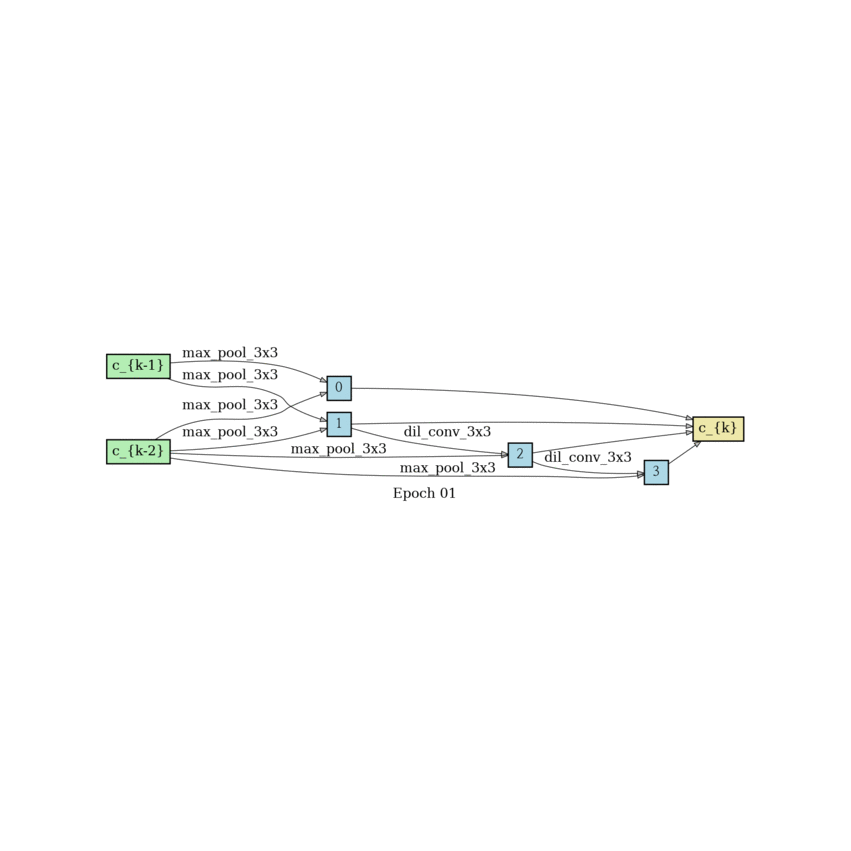
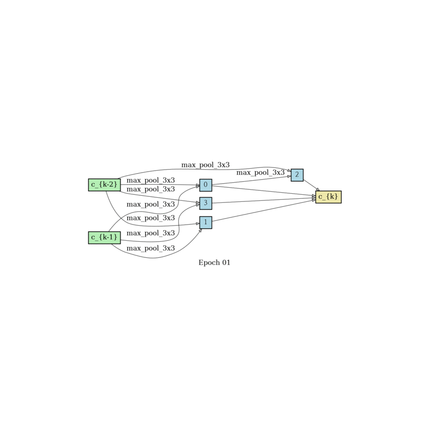
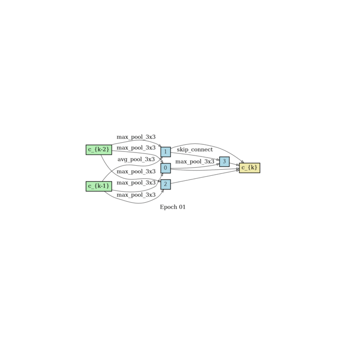
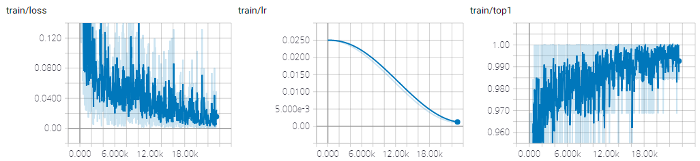
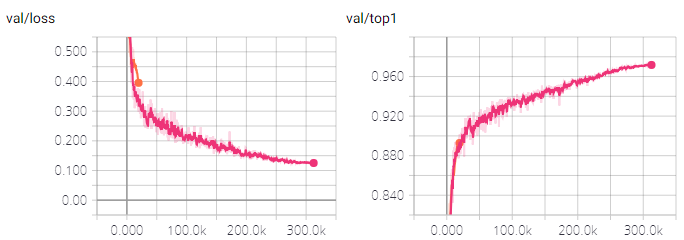
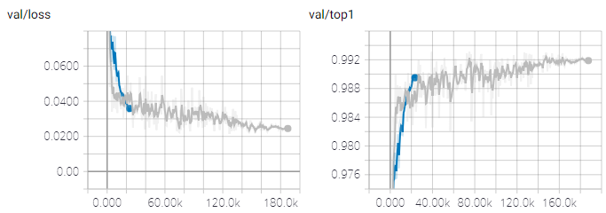

# DARTS: Differentiable Architecture Search

Liu, Hanxiao, Karen Simonyan, and Yiming Yang. "Darts: Differentiable architecture search." arXiv preprint arXiv:1806.09055 (2018). [[arxiv](https://arxiv.org/abs/1806.09055)]

## Requirements

- python 3
- pytorch >= 0.4.1
- graphviz
    - First install using `apt install` and then `pip install`.
- numpy
- tensorboardX

## Run example

Adjust the batch size if out of memory (OOM) occurs. It dependes on your gpu memory size and genotype.

- Search

```shell
python search.py --name cifar10 --dataset cifar10
```

- Augment

```shell
# genotype from search results
python augment.py --name cifar10 --dataset cifar10 --genotype "Genotype(
    normal=[[('sep_conv_3x3', 0), ('dil_conv_5x5', 1)], [('skip_connect', 0), ('dil_conv_3x3', 2)], [('sep_conv_3x3', 1), ('skip_connect', 0)], [('sep_conv_3x3', 1), ('skip_connect', 0)]],
    normal_concat=range(2, 6),
    reduce=[[('max_pool_3x3', 0), ('max_pool_3x3', 1)], [('max_pool_3x3', 0), ('skip_connect', 2)], [('skip_connect', 3), ('max_pool_3x3', 0)], [('skip_connect', 2), ('max_pool_3x3', 0)]],
    reduce_concat=range(2, 6)
)"
```

- with docker

```shell
$ docker run --runtime=nvidia -it khanrc/pytorch-darts:0.2 bash

# you can run directly also
$ docker run --runtime=nvidia -it khanrc/pytorch-darts:0.2 python search.py --name cifar10 --dataset cifar10
```

## Multi-GPU

This project suppports multi-gpu. The larger batch size and learning rate are required to take advantage of multi-gpu.

- Search

```
python search.py --name cifar10-mg --dataset cifar10 --gpus 0,1,2,3 \
    --batch_size 256 --workers 16 --print_freq 10 \
    --w_lr 0.1 --w_lr_min 0.004 --alpha_lr 0.0012
```

- Augment

```
python augment.py --name cifar10-mg --dataset cifar10 --gpus 0,1,2,3 \
    --batch_size 384 --workers 16 --print_freq 50 --lr 0.1 \
    --genotype "Genotype(
    normal=[[('sep_conv_3x3', 0), ('dil_conv_5x5', 1)], [('skip_connect', 0), ('dil_conv_3x3', 2)], [('sep_conv_3x3', 1), ('skip_connect', 0)], [('sep_conv_3x3', 1), ('skip_connect', 0)]],
    normal_concat=range(2, 6),
    reduce=[[('max_pool_3x3', 0), ('max_pool_3x3', 1)], [('max_pool_3x3', 0), ('skip_connect', 2)], [('skip_connect', 3), ('max_pool_3x3', 0)], [('skip_connect', 2), ('max_pool_3x3', 0)]],
    reduce_concat=range(2, 6)
)"
```

Simply, `--gpus all` makes to use all gpus.

### Cautions

It is well-known problem that the larger batch size causes the lower generalization.
Note that although the [linear scaling rule](https://arxiv.org/pdf/1706.02677) prevents this problem somewhat, the generalization still could be bad.

Furthermore, we do not know about the scalability of DARTS, where larger batch size could be more harmful.
So, please pay attention to the hyperparameters when using multi-gpu.

## Results

The following results were obtained using the default arguments, except for the epochs. `--epochs 300` was used in MNIST and Fashion-MNIST.

| Dataset | Final validation acc | Best validation acc |
| ------- | -------------------- | ------------------- |
| MNIST         | 99.75% | 99.81% |
| Fashion-MNIST | 99.27% | 99.39% |
| CIFAR-10       | 97.17% | 97.23% |

97.17%, final validation accuracy in CIFAR-10, is the same number as the paper.

### Found architectures

```py
# CIFAR10
Genotype(
    normal=[[('sep_conv_3x3', 0), ('dil_conv_5x5', 1)], [('skip_connect', 0), ('dil_conv_3x3', 2)], [('sep_conv_3x3', 1), ('skip_connect', 0)], [('sep_conv_3x3', 1), ('skip_connect', 0)]],
    normal_concat=range(2, 6),
    reduce=[[('max_pool_3x3', 0), ('max_pool_3x3', 1)], [('max_pool_3x3', 0), ('skip_connect', 2)], [('skip_connect', 3), ('max_pool_3x3', 0)], [('skip_connect', 2), ('max_pool_3x3', 0)]],
    reduce_concat=range(2, 6)
)

# FashionMNIST
Genotype(
    normal=[[('max_pool_3x3', 0), ('dil_conv_5x5', 1)], [('max_pool_3x3', 0), ('sep_conv_3x3', 1)], [('sep_conv_5x5', 1), ('sep_conv_3x3', 3)], [('sep_conv_5x5', 4), ('dil_conv_5x5', 3)]],
    normal_concat=range(2, 6),
    reduce=[[('sep_conv_3x3', 1), ('avg_pool_3x3', 0)], [('avg_pool_3x3', 0), ('skip_connect', 2)], [('skip_connect', 3), ('avg_pool_3x3', 0)], [('sep_conv_3x3', 2), ('skip_connect', 3)]],
    reduce_concat=range(2, 6)
)

# MNIST
Genotype(
    normal=[[('sep_conv_3x3', 0), ('dil_conv_5x5', 1)], [('sep_conv_3x3', 2), ('sep_conv_3x3', 1)], [('dil_conv_5x5', 3), ('sep_conv_3x3', 1)], [('sep_conv_5x5', 4), ('dil_conv_5x5', 3)]],
    normal_concat=range(2, 6),
    reduce=[[('dil_conv_3x3', 0), ('sep_conv_3x3', 1)], [('avg_pool_3x3', 0), ('skip_connect', 2)], [('dil_conv_5x5', 3), ('avg_pool_3x3', 0)], [('dil_conv_3x3', 1), ('max_pool_3x3', 0)]],
    reduce_concat=range(2, 6)
)
```

### Architecture progress

<p align="center">


<br/> CIFAR-10 
</p>

<p align="center">


<br/> MNIST 
</p>

<p align="center">


<br/> Fashion-MNIST 
</p>

### Plots

<p align="center">

</p>
<p align="center"> Search-training phase of Fashion-MNIST </p>

<p align="center">


</p>
<p align="center"> Augment-validation phase of CIFAR-10 and Fashion-MNIST </p>

## Reference

https://github.com/quark0/darts (official implementation)

### Main differences to reference code

- Supporting pytorch >= 0.4
- Supporting multi-gpu
- Code that is easy to read and commented.
- Implemenation of architect
    - Original implementation is very slow in pytorch >= 0.4.
- Tested on FashionMNIST / MNIST
- Tensorboard
- No RNN

and so on.
